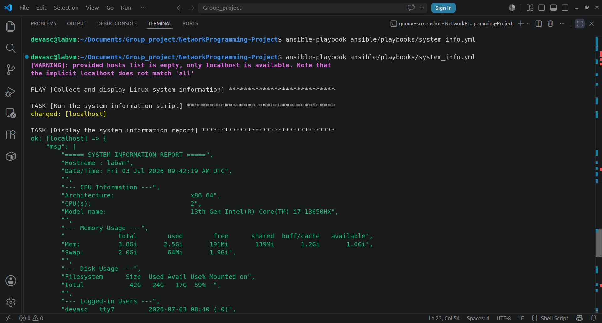
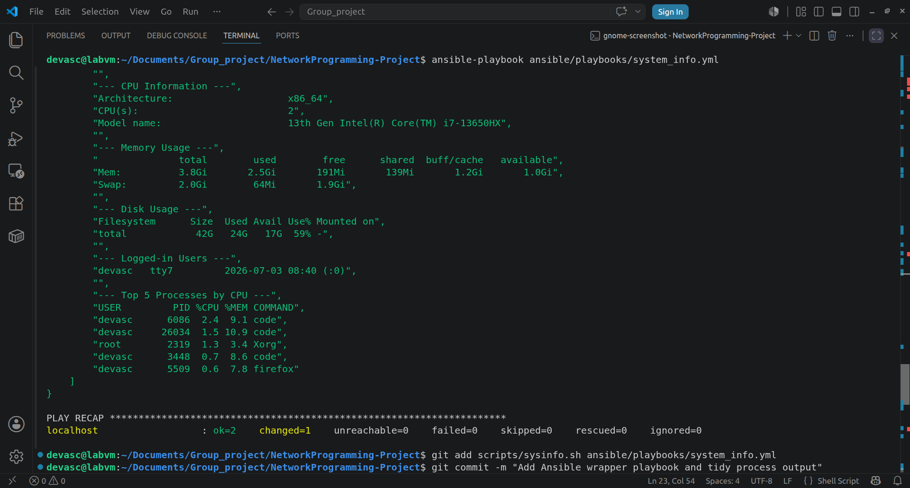

# NetworkProgramming Automated Dashboard

This project automates a network and system administration workflow. It uses Docker to create an isolated lab environment, Ansible to configure a Cisco CSR1000v router, and a script to check Linux system health.

## Folder Structure

```text
ansible/  - Ansible playbooks, inventory.ini, and group_vars
docker/   - Dockerfile and docker-compose.yml for the lab environment
scripts/  - Scripts for Linux system information collection
```

# How to Run

1. Clone the repo.
   
2. Start the docker environment:
    ```text
    cd docker
    docker compose up -d
    ```
    
3. In ansible/inventory.ini, set ansible_host under to your own CSR1000v IP (e.g., 192.168.56.101)
   
4. Enter the Ansible control container:
   ```text
   docker exec -it ansible-control bash
   ```
5. Turn off host key checking (to prevent SSH errors):
   ```text
   export ANSIBLE_HOST_KEY_CHECKING=False
   ```

6. Move to the ansible folder and run the playbooks
   ```text
   cd ansible
    ansible-playbook device_config_a.yaml -i inventory.ini
    ansible-playbook device_config_b.yaml -i inventory.ini
    ansible-playbook device_config_c.yaml -i inventory.ini
    ```

Note:
Ensure your Cisco CSR1000v VM is powered on and fully booted before running the Ansible playbooks.

## Linux System Information Module

Collects and displays: hostname, date/time, CPU info, memory usage,
disk usage, logged-in users, and top 5 processes by CPU usage
(assignment requirement 3c).

**Files:**
- `scripts/sysinfo.sh` — bash script that gathers all 7 items
- `ansible/playbooks/system_info.yml` — Ansible playbook that runs the
  script on a target host and displays the report

**How to run:**

    ansible-playbook ansible/playbooks/system_info.yml

Runs against localhost by default; to target a remote machine, change
`hosts:` in the playbook to any host group from `ansible/inventory.ini`.

**Demo:**



